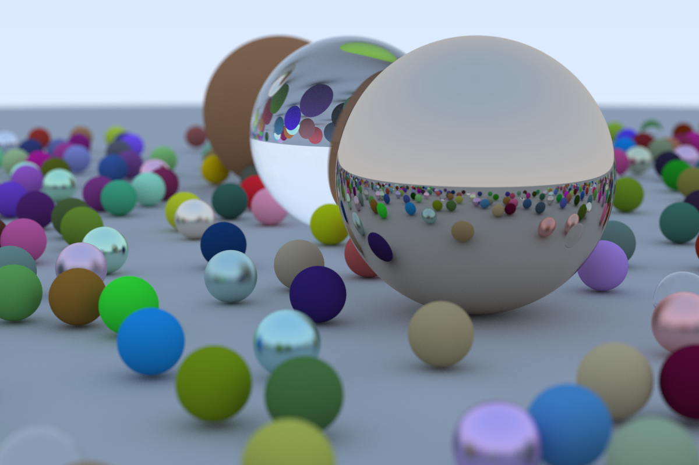

# Ray Tracing

A Re-implementation of [_Ray Tracing in One Weekend Series_](https://raytracing.github.io) written in Rust.

Extra features

- Parallel rendering using thread pool

## Run

```shell
cargo run [OPTIONS]

# Options:
#       --bin [<NAME>]            Name of the bin target to run
#   -p, --package [<SPEC>]        Package with the target to run
#   -r, --release                 Build artifacts in release mode, with optimizations

# e.g. 'cargo run --release --bin in_one_weekend'
```

- [_Ray Tracing in One Weekend_](https://raytracing.github.io/books/RayTracingInOneWeekend.html)
  

- [_Ray Tracing: The Next Week_](https://raytracing.github.io/books/RayTracingTheNextWeek.html)
  Working in progress

- [_Ray Tracing: The Rest of Your Life_](https://raytracing.github.io/books/RayTracingTheRestOfYourLife.html)
  todo
